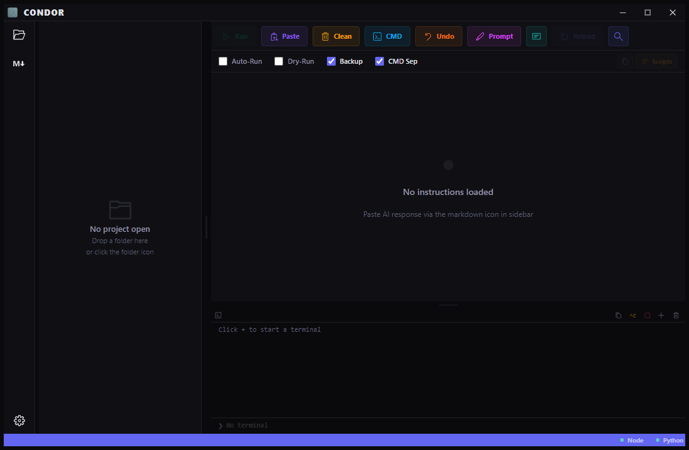

# 🦅 Condor Desktop


**Condor Desktop** es un IDE visual de automatización que lee instrucciones desde archivos `.md` generados por IA y las ejecuta automáticamente. Crea archivos, modifica código, ejecuta comandos en terminal y construye proyectos completos desde una interfaz inspirada en VS Code. La evolución de escritorio del sistema CONDOR.

---

## 📸 Vista Previa

<p align="center">
  
</p>

*Interfaz estilo VS Code con explorador de archivos, editor inline, terminal integrada y barra de actividad.*

---

## ✨ Características Principales

* **Activity Bar:** Barra lateral estilo VS Code para navegar entre explorador, instrucciones, configuración y terminal.
* **Explorer:** Árbol de archivos del proyecto con iconos por tipo, filtrado inteligente y soporte para `.gitignore`.
* **File Editor:** Editor de código integrado para ver y modificar archivos directamente desde la app.
* **Instruction List:** Visualiza las instrucciones parseadas del `.md` con doble clic para editar antes de ejecutar.
* **Terminal Integrada:** Log en tiempo real de la ejecución de comandos con soporte de colores.
* **Config Modal:** Panel de configuración para ajustar comportamiento, rutas y preferencias.
* **Ignore Modal:** Editor visual del archivo `.gitignore` del proyecto.
* **Toolbar Completa:** Botones de acción con iconos — RUN, PASTE, SCAN, SKIP, STOP, UNDO, CMD, SCRIPTS, PROMPT.
* **Status Bar:** Información del proyecto, estado de ejecución y accesos rápidos.
* **Title Bar Personalizada:** Barra de título nativa de Electron con controles de ventana integrados.
* **5 Acciones Automáticas:**
    * `CREAR` → Archivos nuevos con contenido completo.
    * `MODIFICAR` → Sobrescribe archivos existentes.
    * `EJECUTAR` → Comandos CMD con ventana separada opcional.
    * `ELIMINAR` → Borra archivos del proyecto.
    * `REEMPLAZAR` → Cambia líneas específicas dentro de archivos.
* **Estado Global:** Zustand store centralizado para manejar todo el estado de la app.

---

## 🛠️ Stack Tecnológico

Condor Desktop está construido con tecnologías modernas para una experiencia nativa:

* **Frontend:** React 19 + TypeScript
* **Estilos:** Tailwind CSS
* **Runtime:** Electron
* **Build Tool:** Vite
* **Estado:** Zustand
* **IPC:** Electron preload bridge

---

## 🚀 Cómo empezar

1. **Instalar dependencias:**
   ```bash
   npm install
   ```

2. **Ejecutar en modo desarrollo:**
   ```bash
   npm run dev
   ```

3. **Compilar para producción (Windows):**
   ```bash
   npm run build
   ```

---

## 🔄 Flujo de trabajo

```
1. Abre Condor Desktop
2. Selecciona la carpeta del proyecto desde el Explorer
3. Copia el PROMPT con el botón dedicado
4. Pégalo al inicio de tu chat con la IA
5. Pídele lo que necesitas a la IA
6. Copia la respuesta completa (Ctrl+A → Ctrl+C)
7. En Condor presiona PASTE
8. Revisa las instrucciones en el Instruction List
9. Doble clic para editar si necesitas ajustes
10. Presiona RUN → Condor construye todo solo 🦅
```

---

## ⌨️ Atajos de Teclado

| Atajo | Acción |
|-------|--------|
| `Ctrl+V` | Pegar instrucciones desde portapapeles |
| `Ctrl+R` | Ejecutar instrucciones |
| `Ctrl+S` | Analizar archivo .md |
| `Ctrl+Z` | Deshacer último cambio |
| `Ctrl+O` | Abrir explorador de archivos |
| `Esc` | Detener ejecución |

---

## 📂 Estructura del Proyecto

```text
├── assets/
│   ├── Condor.png       # Logo de la aplicación
│   └── view.png         # Captura de pantalla
├── electron/
│   ├── main.cjs         # Proceso principal de Electron
│   └── preload.cjs      # Puente IPC (API Bridge)
├── public/
│   ├── favicon.svg      # Favicon del navegador
│   ├── icon.ico         # Icono de Windows
│   ├── icon.png         # Icono PNG
│   └── icons.svg        # Iconos SVG
├── src/
│   ├── assets/          # Recursos estáticos (imágenes)
│   ├── components/
│   │   ├── ActivityBar    # Barra lateral de navegación
│   │   ├── ConfigModal    # Panel de configuración
│   │   ├── Explorer       # Árbol de archivos del proyecto
│   │   ├── FileEditor     # Editor de código integrado
│   │   ├── IgnoreModal    # Editor de .gitignore
│   │   ├── InstructionList # Lista de instrucciones parseadas
│   │   ├── Main           # Contenido principal
│   │   ├── StatusBar      # Barra de estado inferior
│   │   ├── Terminal       # Log de ejecución en tiempo real
│   │   ├── TitleBar       # Barra de título personalizada
│   │   └── Toolbar        # Botones de acción
│   ├── store/
│   │   └── index.ts       # Estado global (Zustand)
│   ├── App.tsx            # Componente raíz
│   ├── index.css          # Estilos globales
│   └── main.tsx           # Entry point React
├── index.html             # HTML base
├── package.json           # Dependencias y scripts
├── vite.config.ts         # Configuración de Vite
└── README.md              # Este archivo
```

---

## 🔗 Versiones

| Versión | Stack | Descripción |
|---------|-------|-------------|
| **Kondor** (Python) | Tkinter + pystray | Versión ligera y portable, ideal para PCs con pocos recursos |
| **Condor Desktop** | Electron + React | Versión completa estilo VS Code con editor y terminal integrada |

---

## 👤 Autor

Desarrollado con ❤️ en Chile por **CoipoNorte**.
> "Un poquito del sure en el norte de Chile"

---

## 📄 Licencia

Este proyecto es de uso privado para CoipoNorte. Úsalo bajo tu responsabilidad.
